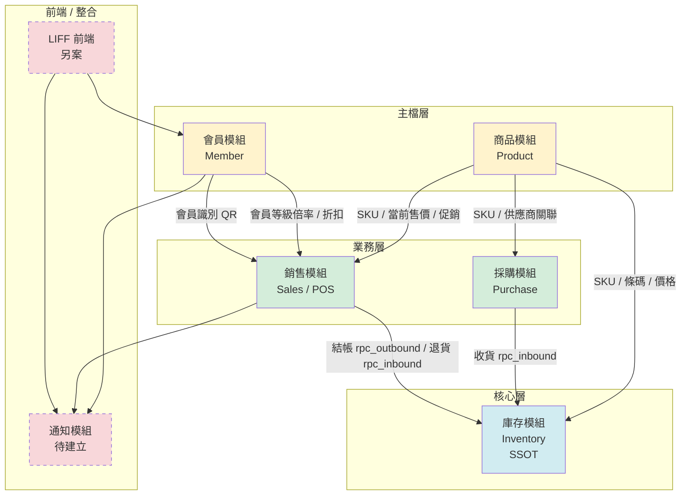
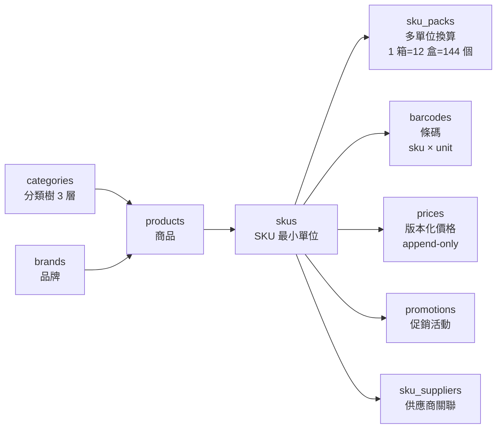
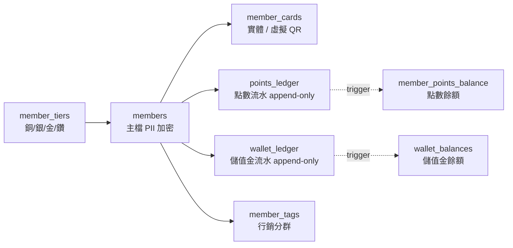
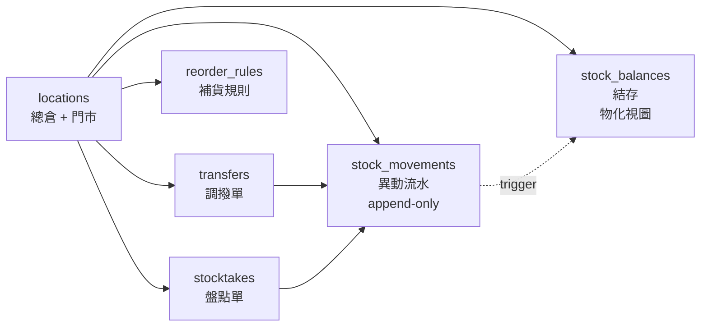
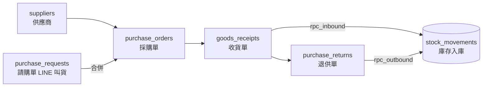
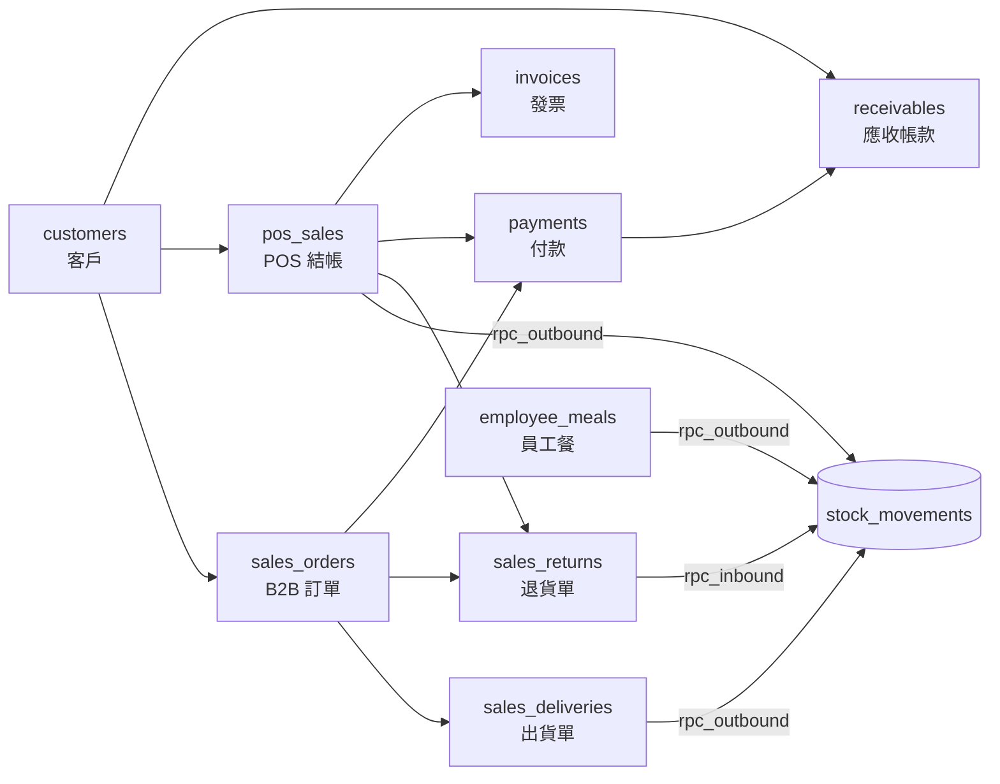

# new_erp — 團購店 ERP

> 零售連鎖 ERP，**業態：團購店**。
> 規模：總倉 1 + 門市 100 + SKU 15,000。
> 狀態：**v0.1 設計階段**（PRD / DB schema 完成，實作尚未開始）。

---

## 目錄結構

```
.
├── README.md                 ← 本文件
└── docs/
    ├── PRD-商品模組.md
    ├── PRD-會員模組.md
    ├── PRD-庫存模組.md
    ├── PRD-採購模組.md
    ├── PRD-條碼模組.md       ← 已併入商品模組，保留為掃碼/列印補充
    ├── PRD-銷售模組.md
    ├── DB-商品模組.md
    ├── DB-會員模組.md
    ├── DB-庫存模組.md
    ├── DB-進貨模組.md
    ├── DB-銷售模組.md
    └── sql/
        ├── product_schema.sql
        ├── member_schema.sql
        ├── inventory_schema.sql
        ├── purchase_schema.sql
        └── sales_schema.sql
```

---

## 模組依賴總覽



**分層原則**：
- 🟡 **主檔層**：其他模組的 FK 根基，不依賴他人
- 🔵 **核心層**：庫存為庫存數字的 Single Source of Truth
- 🟢 **業務層**：落單 / 結帳 / 收貨 — 所有庫存變動皆呼叫核心層 RPC
- 🔴 **待建立**：虛線框為 P0+ 外掛模組（已規劃未實作）

---

## 模組清單

| 模組 | 狀態 | PRD | DB | SQL |
|---|---|---|---|---|
| 商品（Product） | ✅ v0.1 draft | [PRD](docs/PRD-商品模組.md) | [DB](docs/DB-商品模組.md) | [SQL](docs/sql/product_schema.sql) |
| 會員（Member） | ✅ v0.1 draft | [PRD](docs/PRD-會員模組.md) | [DB](docs/DB-會員模組.md) | [SQL](docs/sql/member_schema.sql) |
| 庫存（Inventory） | ✅ v0.1 draft | [PRD](docs/PRD-庫存模組.md) | [DB](docs/DB-庫存模組.md) | [SQL](docs/sql/inventory_schema.sql) |
| 採購（Purchase） | ✅ v0.1 draft | [PRD](docs/PRD-採購模組.md) | [DB](docs/DB-進貨模組.md) | [SQL](docs/sql/purchase_schema.sql) |
| 銷售（Sales / POS） | ✅ v0.1 draft | [PRD](docs/PRD-銷售模組.md) | [DB](docs/DB-銷售模組.md) | [SQL](docs/sql/sales_schema.sql) |
| 條碼（Barcode） | ⚠️ 已併入商品 | [PRD](docs/PRD-條碼模組.md) | — | — |
| 通知（Notification） | 🚧 待建立 | — | — | — |
| 訂單 / 取貨 | 🚧 待確認是否獨立 | — | — | — |

---

## 各模組核心結構

### 🟡 商品模組（Product）

Product / SKU 兩層；條碼 / 多單位 / 定價 / 供應商關聯 / 促銷皆在本模組。



**關鍵決策**：
- 價格四層 scope（retail / store / member_tier / promo），取**最低不疊加**
- 門市店長可自由改本店售價，無需總部審核
- 會員價走 `member_tiers.benefits.discount_rate`，非 per-SKU 訂價

---

### 🟡 會員模組（Member）

手機號 + LIFF 動態 QR 雙主識別；點數 / 儲值金採 append-only ledger。



**關鍵決策**：
- 點數次年底到期、1 點 = 1 元、無單筆上限
- 儲值金不退現
- LINE OA + LIFF 前端（不做原生 APP）
- GDPR 刪除：軟刪除 + PII 清空，歷史流水保留 7 年

---

### 🔵 庫存模組（Inventory）— 所有庫存數字的 SSOT

`stock_movements` append-only 流水 + `stock_balances` 物化餘額，trigger 自動維護。



**關鍵決策**：
- 所有庫存變動**必經** RPC：`rpc_inbound` / `rpc_outbound`
- 成本法：移動平均（`stock_balances.avg_cost`）
- 併發安全：`SELECT FOR UPDATE` + 樂觀鎖 `version`
- 負庫存：DB 允許、應用層預設阻擋

---

### 🟢 採購模組（Purchase）

PR（請購）→ PO（採購單）→ GR（收貨）→ Return（退供）。



**關鍵決策**：
- LINE 文字叫貨 → PR → 合併成 PO
- 只有 GR 確認才動庫存
- `sku_aliases` 學習 LINE 解析

---

### 🟢 銷售模組（Sales / POS）

B2B（SO / Delivery）與 POS 同表分流；退貨 / 付款 / AR / 員工餐一體。



**關鍵決策**：
- B2B vs POS 分表（流程差太大）
- 出貨才扣庫存（SO 確認不扣）
- 發票只存參照，實際開立走舊系統 API

---

## 關鍵設計慣例

### 稽核四欄位

所有可編輯主檔類表必帶：
```sql
created_by   UUID,
updated_by   UUID,
created_at   TIMESTAMPTZ NOT NULL DEFAULT NOW(),
updated_at   TIMESTAMPTZ NOT NULL DEFAULT NOW(),
```

Append-only 流水（`stock_movements`, `points_ledger`, `wallet_ledger`, `*_audit_log`）僅帶 `operator_id` + `created_at`。

### 多租戶

所有表帶 `tenant_id`；v1 只有 1 tenant，架構預留 RLS。

### 時區

一律 `TIMESTAMPTZ`，前端顯示轉台北時區。

### 精度

- 數量 `NUMERIC(18,3)`（散裝 / 重量支援 3 位）
- 金額 `NUMERIC(18,4)`（成本）/ `NUMERIC(18,2)`（總額）
- 折扣率 / 稅率 `NUMERIC(5,4)`（0.0500 = 5%）

---

## 技術棧（目標）

- **資料庫**：PostgreSQL 15+ / Supabase
- **前端**：
  - 內部 ERP：待定（可能 Next.js）
  - 會員 / 取貨：**LINE 官方帳號 + LIFF**（不做原生 APP）
- **通知**：LINE Messaging API（通知模組實作時整合）

---

## 下一步（v0.2）

- [ ] 展開每個模組的 API 合約與 UI wireframe
- [ ] 建立 **通知模組** PRD（跨會員 + 銷售 / 訂單）
- [ ] 確認**訂單 / 取貨流程**是獨立模組還是融入銷售模組
- [ ] Spike：POS 掃碼 → 扣庫存 → 發票 端到端延遲
- [ ] Spike：LIFF 動態 QR HMAC 產生 / 驗證 + APP 端刷新
- [ ] Spike：併發扣儲值金 / 扣點數（100 QPS 同一會員）
- [ ] 資料遷移工具：爬蟲 + CSV loader

---

## 相關文件

- 業態與決策記憶：`.claude/...`（Claude 助手內部記錄）
- PRD Open Questions 進度：商品 13/13 ✅、會員 16/16 ✅
