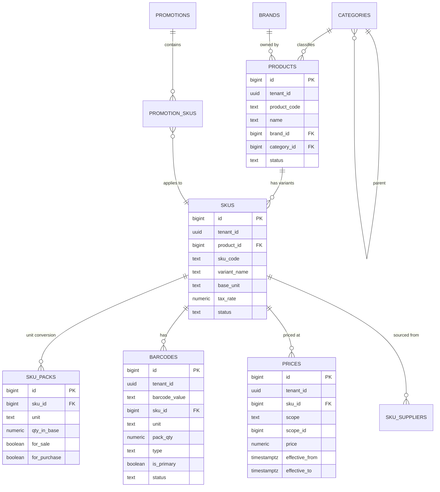

# 商品模組 DB Schema v0.1

> 對應 [[PRD-商品模組]] v0.1。
> 目標資料庫：**PostgreSQL 15+ / Supabase**。
> 純 DDL 檔：[[sql/product_schema]]（`docs/sql/product_schema.sql`）。

---

## 1. 設計原則

| 原則 | 說明 |
|---|---|
| **主檔根基** | `skus` 是其他所有模組的 FK 目標；庫存 / 採購 / 銷售 皆引用 |
| **Product / SKU 兩層** | Product 是業務概念、SKU 是最小變體；允許 1 Product → N SKU |
| **不物理刪除** | 主檔靠 `status` 欄位軟下架（歷史單據仍可引用） |
| **條碼併入** | `barcodes` 表直接關聯 `skus`；支援多條碼 + 多單位 |
| **價格版本化** | `prices` append-only，以 `effective_from/to` 查當前有效價 |
| **多租戶** | 所有表帶 `tenant_id`；條碼 unique 範圍 = `(tenant_id, barcode_value)` |
| **精度** | 金額 `NUMERIC(18,4)`；數量 `NUMERIC(18,3)`；換算係數 `NUMERIC(18,6)` |
| **時區** | 一律 `TIMESTAMPTZ` |
| **稽核四欄位** | 主檔類 / 可編輯表：必帶 `created_by`, `updated_by`, `created_at`, `updated_at`；append-only 流水（如 `prices`, `product_audit_log`）僅 `created_by` + `created_at`；多對多關聯表（如 `promotion_skus`）依操作頻率決定（一般只需 `created_by` + `created_at`） |

---

## 2. ERD（Mermaid）



---

## 3. 資料表清單

| # | 表名 | 角色 | 預估量級 |
|---|---|---|---|
| 1 | `categories` | 分類樹（大/中/小） | ~200 |
| 2 | `brands` | 品牌主檔 | ~500 |
| 3 | `products` | 商品（業務層） | ~12k |
| 4 | `skus` | SKU（庫存單位） | ~15k |
| 5 | `sku_packs` | 多單位換算 | ~30k |
| 6 | `barcodes` | 條碼對應 | ~25k |
| 7 | `internal_barcode_sequence` | 內部條碼流水池 | 1 row |
| 8 | `pending_barcodes` | 未知條碼佇列 | 動態 |
| 9 | `prices` | 價格版本 | 年增 ~200k |
| 10 | `promotions` | 促銷活動主檔 | 年增 ~2k |
| 11 | `promotion_skus` | 促銷適用 SKU | 年增 ~50k |
| 12 | `sku_suppliers` | SKU × 供應商 | ~30k |
| 13 | `product_audit_log` | 主檔稽核 | 年增 ~100k |

---

## 4. 關鍵決策與替代方案

### 4.1 Product / SKU 兩層結構
- **選擇**：兩層（Product 1 → SKU N）
- **理由**：支援變體（容量 / 口味 / 顏色）而不污染 SKU 層級；同類 SKU 共用品名 / 分類 / 品牌
- **替代**：單層（SKU 即 Product）→ 變體管理困難、報表難分組
- **代價**：查詢多一次 JOIN；以 `skus` 寬表 denormalize 部分欄位（`product_name`）緩解熱路徑效能

### 4.2 條碼併入商品模組（原條碼模組）
- **選擇**：`barcodes` 表直接屬本模組
- **理由**：條碼 ↔ SKU 為強耦合；分兩模組會造成跨模組 FK 與部署協調
- **保留**：`PRD-條碼模組` 文件作為掃碼流程 / 列印深入補充

### 4.3 價格版本表 vs 欄位覆寫
- **選擇**：版本表（`prices` append-only + `effective_from/to`）
- **理由**：
  - 支援排程生效（填未來時間）
  - 歷史回溯（退貨原價還原）
  - 稽核天然產生
- **查當前價**：`WHERE effective_from <= NOW() AND (effective_to IS NULL OR effective_to > NOW())`
- **代價**：查詢比單一欄位慢 → 以 `(tenant_id, sku_id, scope, effective_from DESC)` 複合索引 + 可選的 `current_price` 物化視圖緩解

### 4.4 Scope 模型（retail / store / member_tier / promo）
- **選擇**：單一 `prices` 表，用 `scope` + `scope_id` 區分
- **理由**：查當前有效價統一邏輯；新增 scope（未來的 campaign / channel）不改 schema
- **替代**：每個 scope 一張表 → 重複 schema、查價需 UNION

### 4.5 多單位（sku_packs）與條碼的關聯
- **選擇**：`barcodes.unit` 指向該 SKU 的某個 pack；掃箱條碼回 `pack_qty = 144`
- **理由**：箱 / 盒 / 個 可各有獨立條碼且 POS 能自動換算
- **不做**：非整數 pack（0.5 箱）→ `CHECK (qty_in_base > 0)` 不限整數但建議整數

### 4.6 促銷資料模型
- **選擇**：`promotions` + `promotion_skus` 明細；v0.1 只支援「單品時限折扣」
- **理由**：v1 範圍；買 A 送 B / 滿額折 / 點數折抵留給 P1，會涉及銷售模組規則引擎
- **整合**：`prices` 不直接存促銷價；POS 取價時 `promo > member > store > retail` 依序取最低

### 4.7 稅率欄位位置
- **選擇**：`skus.tax_rate`（單一欄位，預設 `0.05`）
- **理由**：台灣普遍 5%，免稅少數；不額外建稅制表
- **未來**：若要支援複合稅 / 多地稅率，擴充為 `tax_rules` 表

### 4.8 軟刪除
- **選擇**：`status` 列舉（`draft / active / inactive / discontinued`），禁物理 DELETE
- **理由**：庫存 / 銷售單據 FK 至 SKU，不能刪
- **實作**：BEFORE DELETE trigger 拋例外；UI 只提供狀態切換

---

## 5. 資料類型與欄位規範

| 類型 | 用法 |
|---|---|
| `UUID` | `tenant_id`, `operator_id` |
| `BIGINT` / `BIGSERIAL` | 內部 PK / FK |
| `TEXT` | 編號、名稱、列舉（以 CHECK 約束） |
| `NUMERIC(18,3)` | 數量、pack_qty |
| `NUMERIC(18,4)` | 金額、成本 |
| `NUMERIC(18,6)` | 換算係數（精細） |
| `NUMERIC(5,4)` | 稅率 / 折扣率（0.0500 = 5%） |
| `JSONB` | `spec`（規格）、`images`（URL 陣列） |
| `TIMESTAMPTZ` | 所有時間欄位（含 `effective_from/to`） |

---

## 6. DDL（完整，可直接執行）

> **稽核欄位慣例**：所有可編輯主檔類表均帶 `created_by`, `updated_by`, `created_at`, `updated_at` 四欄位（見 §1 設計原則）。以下 DDL 摘要；**權威版本請見** `docs/sql/product_schema.sql`。

```sql
-- ============================================
-- Product Module Schema v0.1
-- PostgreSQL 15+ / Supabase
-- ============================================

-- ---------- 1. 分類樹 ----------
CREATE TABLE categories (
  id           BIGSERIAL PRIMARY KEY,
  tenant_id    UUID NOT NULL,
  parent_id    BIGINT REFERENCES categories(id),
  code         TEXT NOT NULL,
  name         TEXT NOT NULL,
  level        SMALLINT NOT NULL CHECK (level BETWEEN 1 AND 3),
  sort_order   INTEGER NOT NULL DEFAULT 0,
  is_active    BOOLEAN NOT NULL DEFAULT TRUE,
  created_at   TIMESTAMPTZ NOT NULL DEFAULT NOW(),
  updated_at   TIMESTAMPTZ NOT NULL DEFAULT NOW(),
  UNIQUE (tenant_id, code)
);
COMMENT ON TABLE categories IS '商品分類樹（大/中/小，最多 3 層）';

-- ---------- 2. 品牌 ----------
CREATE TABLE brands (
  id           BIGSERIAL PRIMARY KEY,
  tenant_id    UUID NOT NULL,
  code         TEXT NOT NULL,
  name         TEXT NOT NULL,
  is_active    BOOLEAN NOT NULL DEFAULT TRUE,
  created_at   TIMESTAMPTZ NOT NULL DEFAULT NOW(),
  updated_at   TIMESTAMPTZ NOT NULL DEFAULT NOW(),
  UNIQUE (tenant_id, code)
);

-- ---------- 3. 商品（業務層） ----------
CREATE TABLE products (
  id             BIGSERIAL PRIMARY KEY,
  tenant_id      UUID NOT NULL,
  product_code   TEXT NOT NULL,
  name           TEXT NOT NULL,
  short_name     TEXT,
  brand_id       BIGINT REFERENCES brands(id),
  category_id    BIGINT REFERENCES categories(id),
  description    TEXT,
  images         JSONB NOT NULL DEFAULT '[]'::jsonb,
  status         TEXT NOT NULL DEFAULT 'draft' CHECK (status IN (
                   'draft','active','inactive','discontinued'
                 )),
  created_by     UUID,
  updated_by     UUID,
  created_at     TIMESTAMPTZ NOT NULL DEFAULT NOW(),
  updated_at     TIMESTAMPTZ NOT NULL DEFAULT NOW(),
  UNIQUE (tenant_id, product_code)
);
COMMENT ON TABLE products IS '商品主檔（業務層級，1 Product 可有 N 個 SKU）';

-- ---------- 4. SKU（庫存單位） ----------
CREATE TABLE skus (
  id             BIGSERIAL PRIMARY KEY,
  tenant_id      UUID NOT NULL,
  product_id     BIGINT NOT NULL REFERENCES products(id),
  sku_code       TEXT NOT NULL,
  variant_name   TEXT,
  spec           JSONB NOT NULL DEFAULT '{}'::jsonb,
  base_unit      TEXT NOT NULL DEFAULT '個',
  weight_g       NUMERIC(18,3),
  tax_rate       NUMERIC(5,4) NOT NULL DEFAULT 0.0500,
  status         TEXT NOT NULL DEFAULT 'draft' CHECK (status IN (
                   'draft','active','inactive','discontinued'
                 )),
  -- denormalize for hot path
  product_name   TEXT,
  category_id    BIGINT,
  brand_id       BIGINT,
  created_by     UUID,
  updated_by     UUID,
  created_at     TIMESTAMPTZ NOT NULL DEFAULT NOW(),
  updated_at     TIMESTAMPTZ NOT NULL DEFAULT NOW(),
  UNIQUE (tenant_id, sku_code)
);
COMMENT ON TABLE skus IS 'SKU：最小庫存管理單位；庫存 / 採購 / 銷售 FK 目標';
COMMENT ON COLUMN skus.product_name IS '熱路徑 denorm：查 SKU 不必 JOIN products';

-- ---------- 5. 多單位換算 ----------
CREATE TABLE sku_packs (
  id              BIGSERIAL PRIMARY KEY,
  sku_id          BIGINT NOT NULL REFERENCES skus(id) ON DELETE CASCADE,
  unit            TEXT NOT NULL,
  qty_in_base     NUMERIC(18,6) NOT NULL CHECK (qty_in_base > 0),
  for_sale        BOOLEAN NOT NULL DEFAULT TRUE,
  for_purchase    BOOLEAN NOT NULL DEFAULT TRUE,
  for_transfer    BOOLEAN NOT NULL DEFAULT TRUE,
  is_default_sale BOOLEAN NOT NULL DEFAULT FALSE,
  created_at      TIMESTAMPTZ NOT NULL DEFAULT NOW(),
  UNIQUE (sku_id, unit)
);
COMMENT ON TABLE sku_packs IS '1 箱 = 12 盒 = 144 個；每 SKU 至少要有一筆 unit = base_unit, qty_in_base = 1';

-- ---------- 6. 條碼 ----------
CREATE TABLE barcodes (
  id              BIGSERIAL PRIMARY KEY,
  tenant_id       UUID NOT NULL,
  barcode_value   TEXT NOT NULL,
  sku_id          BIGINT NOT NULL REFERENCES skus(id),
  unit            TEXT NOT NULL,
  pack_qty        NUMERIC(18,3) NOT NULL DEFAULT 1,
  type            TEXT NOT NULL CHECK (type IN (
                    'ean13','ean8','upca','upce','code128','internal'
                  )),
  is_primary      BOOLEAN NOT NULL DEFAULT FALSE,
  status          TEXT NOT NULL DEFAULT 'active' CHECK (status IN ('active','retired')),
  created_by      UUID,
  created_at      TIMESTAMPTZ NOT NULL DEFAULT NOW(),
  retired_at      TIMESTAMPTZ,
  UNIQUE (tenant_id, barcode_value)
);
COMMENT ON TABLE barcodes IS '條碼 ↔ SKU 對應；同 SKU 可多條碼（原廠 / 內部 / 替換）、多單位';
COMMENT ON COLUMN barcodes.pack_qty IS '此條碼代表的 base_unit 數量（掃箱條碼 = 144）';

-- 每 SKU 僅能有一個 is_primary
CREATE UNIQUE INDEX uniq_barcode_primary_per_sku
  ON barcodes (sku_id) WHERE is_primary = TRUE;

-- ---------- 7. 內部條碼流水池 ----------
CREATE TABLE internal_barcode_sequence (
  tenant_id    UUID PRIMARY KEY,
  next_seq     BIGINT NOT NULL DEFAULT 1,
  updated_at   TIMESTAMPTZ NOT NULL DEFAULT NOW()
);

-- ---------- 8. 未知條碼佇列 ----------
CREATE TABLE pending_barcodes (
  id              BIGSERIAL PRIMARY KEY,
  tenant_id       UUID NOT NULL,
  barcode_value   TEXT NOT NULL,
  scanned_count   INTEGER NOT NULL DEFAULT 1,
  first_scanned_at TIMESTAMPTZ NOT NULL DEFAULT NOW(),
  last_scanned_at  TIMESTAMPTZ NOT NULL DEFAULT NOW(),
  last_context    TEXT,
  resolved        BOOLEAN NOT NULL DEFAULT FALSE,
  resolved_sku_id BIGINT REFERENCES skus(id),
  resolved_by     UUID,
  resolved_at     TIMESTAMPTZ,
  UNIQUE (tenant_id, barcode_value)
);

-- ---------- 9. 價格（版本化，append-only） ----------
CREATE TABLE prices (
  id              BIGSERIAL PRIMARY KEY,
  tenant_id       UUID NOT NULL,
  sku_id          BIGINT NOT NULL REFERENCES skus(id),
  scope           TEXT NOT NULL CHECK (scope IN (
                    'retail','store','member_tier','promo'
                  )),
  scope_id        BIGINT,
  price           NUMERIC(18,4) NOT NULL CHECK (price >= 0),
  currency        TEXT NOT NULL DEFAULT 'TWD',
  effective_from  TIMESTAMPTZ NOT NULL DEFAULT NOW(),
  effective_to    TIMESTAMPTZ,
  reason          TEXT,
  created_by      UUID NOT NULL,
  created_at      TIMESTAMPTZ NOT NULL DEFAULT NOW(),
  CHECK (effective_to IS NULL OR effective_to > effective_from)
);
COMMENT ON TABLE prices IS '價格版本表（append-only）；scope=retail/store/member_tier/promo';
COMMENT ON COLUMN prices.scope_id IS 'store: location_id / member_tier: tier_id / promo: promotion_id';

-- ---------- 10. 促銷活動 ----------
CREATE TABLE promotions (
  id            BIGSERIAL PRIMARY KEY,
  tenant_id     UUID NOT NULL,
  code          TEXT NOT NULL,
  name          TEXT NOT NULL,
  type          TEXT NOT NULL CHECK (type IN ('fixed','percent')),
  discount      NUMERIC(18,4) NOT NULL CHECK (discount > 0),
  start_at      TIMESTAMPTZ NOT NULL,
  end_at        TIMESTAMPTZ NOT NULL,
  status        TEXT NOT NULL DEFAULT 'scheduled' CHECK (status IN (
                  'draft','scheduled','active','ended','cancelled'
                )),
  applicable_store_ids BIGINT[] NOT NULL DEFAULT '{}',
  created_by    UUID NOT NULL,
  created_at    TIMESTAMPTZ NOT NULL DEFAULT NOW(),
  updated_at    TIMESTAMPTZ NOT NULL DEFAULT NOW(),
  UNIQUE (tenant_id, code),
  CHECK (end_at > start_at)
);
COMMENT ON COLUMN promotions.type IS 'fixed: 折後固定價; percent: 折扣率 (0.80 = 8 折)';

CREATE TABLE promotion_skus (
  promotion_id  BIGINT NOT NULL REFERENCES promotions(id) ON DELETE CASCADE,
  sku_id        BIGINT NOT NULL REFERENCES skus(id),
  PRIMARY KEY (promotion_id, sku_id)
);

-- ---------- 11. SKU × 供應商 ----------
CREATE TABLE sku_suppliers (
  id                  BIGSERIAL PRIMARY KEY,
  tenant_id           UUID NOT NULL,
  sku_id              BIGINT NOT NULL REFERENCES skus(id),
  supplier_id         BIGINT NOT NULL,
  supplier_sku_code   TEXT,
  lead_time_days      INTEGER,
  min_order_qty       NUMERIC(18,3),
  last_cost           NUMERIC(18,4),
  is_preferred        BOOLEAN NOT NULL DEFAULT FALSE,
  created_at          TIMESTAMPTZ NOT NULL DEFAULT NOW(),
  updated_at          TIMESTAMPTZ NOT NULL DEFAULT NOW(),
  UNIQUE (tenant_id, sku_id, supplier_id)
);
COMMENT ON TABLE sku_suppliers IS 'SKU 可由哪些供應商提供；supplier_id 指向採購模組 suppliers';

-- 每 SKU 僅能有一個 is_preferred
CREATE UNIQUE INDEX uniq_sku_supplier_preferred
  ON sku_suppliers (tenant_id, sku_id) WHERE is_preferred = TRUE;

-- ---------- 12. 稽核日誌 ----------
CREATE TABLE product_audit_log (
  id           BIGSERIAL PRIMARY KEY,
  tenant_id    UUID NOT NULL,
  entity_type  TEXT NOT NULL CHECK (entity_type IN (
                 'product','sku','barcode','price','promotion','sku_supplier','sku_pack'
               )),
  entity_id    BIGINT NOT NULL,
  action       TEXT NOT NULL CHECK (action IN ('create','update','delete','status_change','retire')),
  before_value JSONB,
  after_value  JSONB,
  reason       TEXT,
  operator_id  UUID NOT NULL,
  operator_ip  INET,
  created_at   TIMESTAMPTZ NOT NULL DEFAULT NOW()
);
```

---

## 7. Trigger：禁止物理刪除 + 主檔變更稽核

```sql
CREATE OR REPLACE FUNCTION forbid_sku_delete()
RETURNS TRIGGER AS $$
BEGIN
  RAISE EXCEPTION 'skus cannot be deleted. Set status = discontinued instead.';
END;
$$ LANGUAGE plpgsql;

CREATE TRIGGER trg_no_delete_sku BEFORE DELETE ON skus
  FOR EACH ROW EXECUTE FUNCTION forbid_sku_delete();

CREATE TRIGGER trg_no_delete_product BEFORE DELETE ON products
  FOR EACH ROW EXECUTE FUNCTION forbid_sku_delete();

-- updated_at 自動更新
CREATE OR REPLACE FUNCTION touch_updated_at()
RETURNS TRIGGER AS $$
BEGIN
  NEW.updated_at := NOW();
  RETURN NEW;
END;
$$ LANGUAGE plpgsql;

CREATE TRIGGER trg_touch_products BEFORE UPDATE ON products
  FOR EACH ROW EXECUTE FUNCTION touch_updated_at();
CREATE TRIGGER trg_touch_skus BEFORE UPDATE ON skus
  FOR EACH ROW EXECUTE FUNCTION touch_updated_at();
CREATE TRIGGER trg_touch_categories BEFORE UPDATE ON categories
  FOR EACH ROW EXECUTE FUNCTION touch_updated_at();
CREATE TRIGGER trg_touch_brands BEFORE UPDATE ON brands
  FOR EACH ROW EXECUTE FUNCTION touch_updated_at();
CREATE TRIGGER trg_touch_promotions BEFORE UPDATE ON promotions
  FOR EACH ROW EXECUTE FUNCTION touch_updated_at();
```

---

## 8. 索引策略

```sql
-- 條碼 lookup 熱路徑（最重要）
CREATE INDEX idx_barcode_lookup
  ON barcodes (tenant_id, barcode_value)
  WHERE status = 'active';

-- 非 active 也可掃到（退役提示用）
CREATE INDEX idx_barcode_all
  ON barcodes (tenant_id, barcode_value);

-- SKU 主檔查詢
CREATE INDEX idx_skus_product
  ON skus (tenant_id, product_id)
  WHERE status = 'active';

CREATE INDEX idx_skus_category
  ON skus (tenant_id, category_id, status);

-- Product 查詢
CREATE INDEX idx_products_category
  ON products (tenant_id, category_id, status);
CREATE INDEX idx_products_brand
  ON products (tenant_id, brand_id, status);

-- 價格查詢：同一 scope 取最新有效
CREATE INDEX idx_prices_lookup
  ON prices (tenant_id, sku_id, scope, scope_id, effective_from DESC);

-- 價格時間區間查詢（回溯歷史價）
CREATE INDEX idx_prices_time_range
  ON prices (tenant_id, sku_id, effective_from, effective_to);

-- 促銷查詢
CREATE INDEX idx_promotions_active
  ON promotions (tenant_id, status, start_at, end_at);

-- 供應商關聯
CREATE INDEX idx_sku_suppliers_sku
  ON sku_suppliers (tenant_id, sku_id);
CREATE INDEX idx_sku_suppliers_supplier
  ON sku_suppliers (tenant_id, supplier_id);

-- 稽核日誌
CREATE INDEX idx_audit_entity
  ON product_audit_log (tenant_id, entity_type, entity_id, created_at DESC);

-- pending_barcodes
CREATE INDEX idx_pending_barcode_unresolved
  ON pending_barcodes (tenant_id, resolved, last_scanned_at DESC)
  WHERE resolved = FALSE;
```

---

## 9. RLS（Row-Level Security）

```sql
ALTER TABLE categories            ENABLE ROW LEVEL SECURITY;
ALTER TABLE brands                ENABLE ROW LEVEL SECURITY;
ALTER TABLE products              ENABLE ROW LEVEL SECURITY;
ALTER TABLE skus                  ENABLE ROW LEVEL SECURITY;
ALTER TABLE sku_packs             ENABLE ROW LEVEL SECURITY;
ALTER TABLE barcodes              ENABLE ROW LEVEL SECURITY;
ALTER TABLE prices                ENABLE ROW LEVEL SECURITY;
ALTER TABLE promotions            ENABLE ROW LEVEL SECURITY;
ALTER TABLE promotion_skus        ENABLE ROW LEVEL SECURITY;
ALTER TABLE sku_suppliers         ENABLE ROW LEVEL SECURITY;
ALTER TABLE product_audit_log     ENABLE ROW LEVEL SECURITY;
ALTER TABLE pending_barcodes      ENABLE ROW LEVEL SECURITY;

-- 所有角色皆可讀本 tenant 主檔（POS、查庫存、查價都會讀）
CREATE POLICY read_tenant_products ON products
  FOR SELECT USING (tenant_id = (auth.jwt() ->> 'tenant_id')::uuid);
CREATE POLICY read_tenant_skus ON skus
  FOR SELECT USING (tenant_id = (auth.jwt() ->> 'tenant_id')::uuid);
CREATE POLICY read_tenant_barcodes ON barcodes
  FOR SELECT USING (tenant_id = (auth.jwt() ->> 'tenant_id')::uuid);
CREATE POLICY read_tenant_prices ON prices
  FOR SELECT USING (tenant_id = (auth.jwt() ->> 'tenant_id')::uuid);

-- 寫入：一律走 RPC（SECURITY DEFINER），不開放直接 INSERT/UPDATE
```

---

## 10. 關鍵寫入 RPC 範例

```sql
-- 條碼 lookup（熱路徑）
CREATE OR REPLACE FUNCTION rpc_barcode_lookup(
  p_tenant_id UUID,
  p_barcode TEXT,
  p_context TEXT DEFAULT 'pos'
) RETURNS TABLE (
  sku_id        BIGINT,
  sku_code      TEXT,
  product_name  TEXT,
  unit          TEXT,
  pack_qty      NUMERIC,
  status        TEXT,
  barcode_status TEXT
) AS $$
BEGIN
  RETURN QUERY
  SELECT s.id, s.sku_code, s.product_name, b.unit, b.pack_qty, s.status, b.status
  FROM barcodes b
  JOIN skus s ON s.id = b.sku_id
  WHERE b.tenant_id = p_tenant_id
    AND b.barcode_value = p_barcode
  LIMIT 1;
END;
$$ LANGUAGE plpgsql STABLE SECURITY DEFINER;

-- 取當前有效價（優先序：promo > member > store > retail）
CREATE OR REPLACE FUNCTION rpc_current_price(
  p_tenant_id   UUID,
  p_sku_id      BIGINT,
  p_location_id BIGINT,
  p_member_tier BIGINT DEFAULT NULL,
  p_at          TIMESTAMPTZ DEFAULT NOW()
) RETURNS NUMERIC AS $$
DECLARE
  v_price NUMERIC;
BEGIN
  -- 1. promo（取符合期間且該 SKU 有適用的最低價）
  SELECT p.price INTO v_price
  FROM prices p
  JOIN promotion_skus ps ON ps.promotion_id = p.scope_id AND ps.sku_id = p.sku_id
  JOIN promotions pr ON pr.id = p.scope_id
  WHERE p.tenant_id = p_tenant_id
    AND p.sku_id = p_sku_id
    AND p.scope = 'promo'
    AND p.effective_from <= p_at
    AND (p.effective_to IS NULL OR p.effective_to > p_at)
    AND pr.status = 'active'
    AND (array_length(pr.applicable_store_ids, 1) IS NULL
         OR p_location_id = ANY(pr.applicable_store_ids))
  ORDER BY p.price ASC
  LIMIT 1;
  IF v_price IS NOT NULL THEN RETURN v_price; END IF;

  -- 2. member_tier
  IF p_member_tier IS NOT NULL THEN
    SELECT price INTO v_price FROM prices
    WHERE tenant_id = p_tenant_id AND sku_id = p_sku_id
      AND scope = 'member_tier' AND scope_id = p_member_tier
      AND effective_from <= p_at
      AND (effective_to IS NULL OR effective_to > p_at)
    ORDER BY effective_from DESC LIMIT 1;
    IF v_price IS NOT NULL THEN RETURN v_price; END IF;
  END IF;

  -- 3. store
  SELECT price INTO v_price FROM prices
  WHERE tenant_id = p_tenant_id AND sku_id = p_sku_id
    AND scope = 'store' AND scope_id = p_location_id
    AND effective_from <= p_at
    AND (effective_to IS NULL OR effective_to > p_at)
  ORDER BY effective_from DESC LIMIT 1;
  IF v_price IS NOT NULL THEN RETURN v_price; END IF;

  -- 4. retail
  SELECT price INTO v_price FROM prices
  WHERE tenant_id = p_tenant_id AND sku_id = p_sku_id
    AND scope = 'retail'
    AND effective_from <= p_at
    AND (effective_to IS NULL OR effective_to > p_at)
  ORDER BY effective_from DESC LIMIT 1;

  RETURN v_price;
END;
$$ LANGUAGE plpgsql STABLE SECURITY DEFINER;

-- 排程變價：插入新版 + 關閉舊版
CREATE OR REPLACE FUNCTION rpc_upsert_price(
  p_tenant_id      UUID,
  p_sku_id         BIGINT,
  p_scope          TEXT,
  p_scope_id       BIGINT,
  p_price          NUMERIC,
  p_effective_from TIMESTAMPTZ,
  p_reason         TEXT,
  p_operator       UUID
) RETURNS BIGINT AS $$
DECLARE
  v_id BIGINT;
BEGIN
  -- 關閉同 scope 舊版：effective_to = 新版 effective_from
  UPDATE prices
     SET effective_to = p_effective_from
   WHERE tenant_id = p_tenant_id
     AND sku_id = p_sku_id
     AND scope = p_scope
     AND (scope_id IS NOT DISTINCT FROM p_scope_id)
     AND (effective_to IS NULL OR effective_to > p_effective_from);

  INSERT INTO prices (tenant_id, sku_id, scope, scope_id, price,
                      effective_from, reason, created_by)
  VALUES (p_tenant_id, p_sku_id, p_scope, p_scope_id, p_price,
          p_effective_from, p_reason, p_operator)
  RETURNING id INTO v_id;

  RETURN v_id;
END;
$$ LANGUAGE plpgsql SECURITY DEFINER;

-- 產生內部條碼
CREATE OR REPLACE FUNCTION rpc_generate_internal_barcode(
  p_tenant_id UUID,
  p_sku_id    BIGINT,
  p_unit      TEXT,
  p_pack_qty  NUMERIC,
  p_operator  UUID
) RETURNS TEXT AS $$
DECLARE
  v_seq     BIGINT;
  v_date    TEXT;
  v_value   TEXT;
  v_check   CHAR;
BEGIN
  INSERT INTO internal_barcode_sequence (tenant_id, next_seq)
  VALUES (p_tenant_id, 1)
  ON CONFLICT (tenant_id) DO UPDATE
    SET next_seq = internal_barcode_sequence.next_seq + 1,
        updated_at = NOW()
  RETURNING next_seq INTO v_seq;

  v_date  := TO_CHAR(NOW(), 'YYMMDD');
  v_value := 'LT' || v_date || LPAD(v_seq::text, 5, '0');
  -- check digit: 簡化版（模 10 對位和）
  v_check := ((LENGTH(v_value) * 7 + v_seq) % 10)::text;
  v_value := v_value || v_check;

  INSERT INTO barcodes (tenant_id, barcode_value, sku_id, unit, pack_qty, type, created_by)
  VALUES (p_tenant_id, v_value, p_sku_id, p_unit, p_pack_qty, 'internal', p_operator);

  RETURN v_value;
END;
$$ LANGUAGE plpgsql SECURITY DEFINER;
```

---

## 11. 常見查詢

```sql
-- 1. 條碼 → SKU（POS 熱路徑）
SELECT s.id, s.product_name, b.unit, b.pack_qty, s.status
FROM barcodes b JOIN skus s ON s.id = b.sku_id
WHERE b.tenant_id = $1 AND b.barcode_value = $2;

-- 2. SKU 當前售價（已封裝為 rpc_current_price）
SELECT rpc_current_price($tenant, $sku, $location, $member_tier);

-- 3. 某 SKU 所有條碼
SELECT barcode_value, type, unit, pack_qty, is_primary, status
FROM barcodes WHERE tenant_id = $1 AND sku_id = $2 ORDER BY is_primary DESC;

-- 4. 某時間點 SKU 的歷史售價
SELECT price, effective_from, effective_to, scope, scope_id, reason
FROM prices
WHERE tenant_id = $1 AND sku_id = $2
  AND effective_from <= $3
  AND (effective_to IS NULL OR effective_to > $3)
ORDER BY scope, effective_from DESC;

-- 5. 未處理的未知條碼（給主檔管理員清單）
SELECT barcode_value, scanned_count, last_scanned_at, last_context
FROM pending_barcodes
WHERE tenant_id = $1 AND resolved = FALSE
ORDER BY scanned_count DESC, last_scanned_at DESC;

-- 6. 某分類下的 active SKU
SELECT s.id, s.sku_code, s.product_name, s.variant_name
FROM skus s
WHERE s.tenant_id = $1 AND s.category_id = $2 AND s.status = 'active'
ORDER BY s.product_name;

-- 7. 促銷中的 SKU（給 POS 顯示促銷標）
SELECT pr.code, pr.name, pr.type, pr.discount, s.sku_code
FROM promotions pr
JOIN promotion_skus ps ON ps.promotion_id = pr.id
JOIN skus s ON s.id = ps.sku_id
WHERE pr.tenant_id = $1
  AND pr.status = 'active'
  AND NOW() BETWEEN pr.start_at AND pr.end_at;
```

---

## 12. 資料遷移（舊系統 → 新 Schema）

建議路徑：
1. 匯入 `categories`、`brands`（無依賴）
2. 匯入 `products`（依賴 categories / brands）
3. 匯入 `skus`（依賴 products；denorm 欄位同時填）
4. 匯入 `sku_packs`（每 SKU 至少 1 筆 base_unit = 1）
5. 匯入 `barcodes`（依賴 skus；多條碼一併寫入）
6. 匯入 `prices`（scope=retail 一份，`effective_from = now()`）
7. 匯入 `sku_suppliers`（待採購模組 `suppliers` 主檔就位）

---

## 13. Open Questions（影響 Schema 的決策）
- [ ] Product / SKU 是否真需要兩層？若 1:1，可把 `products` 退化為 `skus` 的一組欄位
- [ ] `skus.tax_rate` 是否足以描述所有稅制？會不會有免稅 / 兩稅制需求？
- [ ] `barcodes.pack_qty` vs `sku_packs.qty_in_base` 兩者若不一致以誰為準？（目前設計：條碼自帶 pack_qty，不強綁 sku_packs；需要一致性檢查或 CASCADE）
- [ ] `prices.scope_id` 型別用 `BIGINT` 夠不夠？未來若 scope = channel 可能用 UUID → 考慮改 `TEXT` 或加型別欄位
- [ ] 促銷是否要支援「會員 + 促銷 取較低」？目前優先序是 promo > member，無疊加
- [ ] 單品促銷是否已足夠 v1？若要滿額 / 組合折扣，需獨立規則引擎

---

## 14. 下一步
- [ ] 把本 schema 套到 Supabase dev 環境
- [ ] 寫 seed：1 tenant + 5 分類 + 3 品牌 + 10 products + 20 SKUs + 30 條碼 + 50 prices
- [ ] 單元測試：條碼綁定 / 退役、價格排程切換、RPC current_price 四層優先序
- [ ] 效能測試：barcode lookup P95 < 50ms（50k 條碼 + 15k SKU 資料量）
- [ ] 回答 §13 Open Questions → v0.2

---

## 相關連結
- [[PRD-商品模組]]
- [[PRD-條碼模組]] — v0.1 已併入，保留為掃碼流程深入補充
- [[PRD-庫存模組]] — `stock_balances` 以 `skus.id` 為 FK 目標
- [[PRD-採購模組]] — `sku_suppliers.supplier_id` 指向 `suppliers`
- [[PRD-銷售模組]] — POS 呼叫 `rpc_barcode_lookup` + `rpc_current_price`
- [[PRD-會員模組]] — 會員等級 tier_id 對應 `prices.scope = member_tier`
- 純 DDL：`docs/sql/product_schema.sql`
