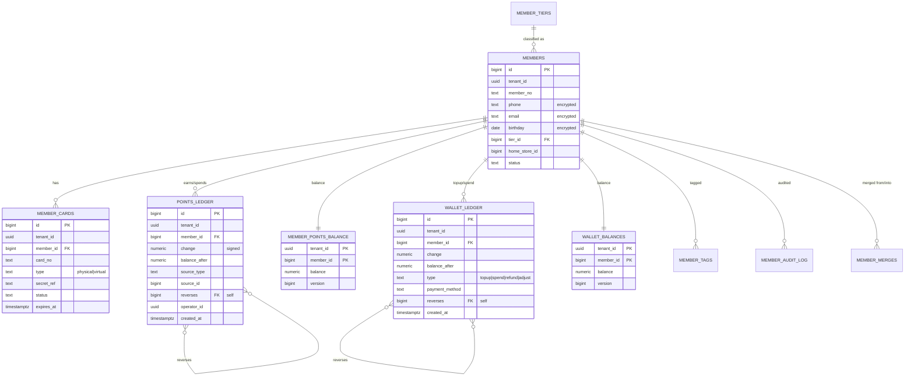

# 會員模組 DB Schema v0.1

> 對應 [[PRD-會員模組]] v0.1。
> 目標資料庫：**PostgreSQL 15+ / Supabase**。
> 純 DDL 檔：[[sql/member_schema]]（`docs/sql/member_schema.sql`）。

---

## 1. 設計原則

| 原則 | 說明 |
|---|---|
| **Append-only ledger** | 點數 / 儲值金異動走 `*_ledger`；餘額表由 trigger 維護（同庫存模組架構） |
| **餘額物化** | `member_points_balance`、`wallet_balances` 提供 O(1) 餘額查詢 |
| **併發安全** | Ledger INSERT trigger 內 `SELECT FOR UPDATE` balance 列，避免超扣 |
| **更正機制** | 反向流水（`reverses` / `reversed_by`），不改原紀錄 |
| **PII 保護** | `phone` / `email` / `birthday` 可選欄位層加密（pgcrypto）；顯示層 masked |
| **軟刪除** | `status = deleted` + PII 清空（hash 化）；歷史單據 FK 仍成立 |
| **多租戶** | 所有表帶 `tenant_id`；RLS 隔離 |
| **卡片簽章** | QR payload 帶 HMAC；secret 存 `member_cards.secret_ref`（指向 KMS / vault），不明碼落庫 |
| **時區** | 一律 `TIMESTAMPTZ` |
| **稽核四欄位** | 主檔類 / 可編輯表：必帶 `created_by`, `updated_by`, `created_at`, `updated_at`；append-only 流水（`points_ledger`, `wallet_ledger`, `member_audit_log`, `member_merges`）僅 `operator_id` + `created_at`（`operator_id` 扮演 `created_by`）；物化餘額表（`member_points_balance`, `wallet_balances`）由 trigger 維護，僅需 `version` + `updated_at` |

---

## 2. ERD（Mermaid）



---

## 3. 資料表清單

| # | 表名 | 角色 | 預估量級 |
|---|---|---|---|
| 1 | `member_tiers` | 會員等級（銅銀金鑽） | ~4 |
| 2 | `members` | 會員主檔 | ~500k（成熟期） |
| 3 | `member_cards` | 會員卡（含 QR） | ~700k |
| 4 | `points_ledger` | 點數流水 | 年增 ~10M |
| 5 | `member_points_balance` | 點數餘額 | ~500k |
| 6 | `wallet_ledger` | 儲值金流水 | 年增 ~2M |
| 7 | `wallet_balances` | 儲值金餘額 | ~300k |
| 8 | `member_tags` | 標籤 | ~1.5M |
| 9 | `member_audit_log` | 稽核 | 年增 ~500k |
| 10 | `member_merges` | 合併歷史 | 動態 |

---

## 4. 關鍵決策與替代方案

### 4.1 Ledger + Balance 架構
- **選擇**：點數 / 儲值金皆採「流水表（append-only）+ 餘額表（物化）」
- **理由**：
  - 餘額查詢 O(1)
  - 所有異動可追溯來源、可反向沖正、稽核天然
  - 與庫存模組 `stock_movements` 一致，降低認知成本
- **替代**：僅存餘額欄位 → 無法稽核、無法重建

### 4.2 Balance 維護：Trigger
- **選擇**：`AFTER INSERT ON ledger → UPDATE balance`
- **內嵌 `SELECT FOR UPDATE`**：確保同一會員併發扣款排隊、不會負
- **Append-only 保護**：BEFORE UPDATE/DELETE trigger 拋例外

### 4.3 QR Payload 簽章
- **選擇**：HMAC-SHA256 + TTL 30s + nonce
- **Secret 存放**：`member_cards.secret_ref` 存 reference（如 Supabase Vault key id），不存明碼
- **驗簽位置**：Server 端（POS 提交 payload）；離線時 POS 端驗簽（secret 需端末同步）— 安全風險列入 Open Question

### 4.4 PII 加密
- **選擇**：欄位層加密（`pgcrypto.pgp_sym_encrypt`）+ 顯示層 masked
- **範圍**：`phone` / `email` / `birthday`
- **替代**：整表加密 → 查詢困難、效能差
- **索引**：`phone` 需查 → 存明碼 hash `phone_hash`（`SHA256(normalized_phone)`）做 unique + lookup；原 `phone` 加密
- **實作**：
  - Insert：app 傳 `phone_plain` → server 算 `phone_hash` + 加密 `phone_enc`
  - Query by phone：算 hash → `WHERE phone_hash = $1`

### 4.5 手機號唯一
- **選擇**：`(tenant_id, phone_hash)` UNIQUE
- **例外**：同手機重辦 → 業務層攔截並提示合併（不是 DB 層阻擋）
- **trade-off**：若預期家人共用一支手機 → 需放寬為 NOT UNIQUE（Open Question）

### 4.6 軟刪除 + PII 清除
- **選擇**：
  - `status = deleted`
  - `phone_enc = NULL`、`phone_hash = 'DELETED_' || id`（保 unique）
  - `email_enc / birthday_enc / name = NULL`
- **歷史流水**：不動（FK 保留）
- **實作**：`rpc_member_gdpr_delete(...)` 統一處理

### 4.7 多卡
- **選擇**：`member_cards` 表，一會員 N 卡
- **Primary 卡**：`is_primary` + unique partial index
- **換卡**：新卡 active、舊卡 retired；掃舊卡仍識別但提示

### 4.8 不存 Name 在 Ledger
- **選擇**：Ledger 僅存 `member_id`；姓名改名後歷史仍正確
- **稽核顯示**：查時 JOIN `members`（若 deleted → 顯示「已註銷會員」）

---

## 5. 資料類型與欄位規範

| 類型 | 用法 |
|---|---|
| `UUID` | `tenant_id`, `operator_id` |
| `BIGINT` / `BIGSERIAL` | 內部 PK / FK |
| `TEXT` | 編號、列舉（CHECK）、遮罩資料 |
| `BYTEA` | 加密後的 PII（`phone_enc` 等） |
| `TEXT` (hash) | PII hash（`phone_hash = sha256hex`） |
| `NUMERIC(18,2)` | 點數餘額（可小數 2 位） / 儲值金金額 |
| `TIMESTAMPTZ` | 所有時間 |
| `JSONB` | `benefits`（等級權益） / `metadata` |

---

## 6. DDL（完整，可直接執行）

> **稽核欄位慣例**：所有可編輯主檔類表均帶 `created_by`, `updated_by`, `created_at`, `updated_at` 四欄位；append-only ledger 僅 `operator_id` + `created_at`（見 §1 設計原則）。以下 DDL 摘要；**權威版本請見** `docs/sql/member_schema.sql`。

```sql
-- ============================================
-- Member Module Schema v0.1
-- PostgreSQL 15+ / Supabase
-- ============================================

CREATE EXTENSION IF NOT EXISTS pgcrypto;

-- ---------- 1. 會員等級 ----------
CREATE TABLE member_tiers (
  id           BIGSERIAL PRIMARY KEY,
  tenant_id    UUID NOT NULL,
  code         TEXT NOT NULL,
  name         TEXT NOT NULL,
  sort_order   INTEGER NOT NULL DEFAULT 0,
  benefits     JSONB NOT NULL DEFAULT '{}'::jsonb,
  is_active    BOOLEAN NOT NULL DEFAULT TRUE,
  created_at   TIMESTAMPTZ NOT NULL DEFAULT NOW(),
  updated_at   TIMESTAMPTZ NOT NULL DEFAULT NOW(),
  UNIQUE (tenant_id, code)
);
COMMENT ON COLUMN member_tiers.benefits IS '{points_multiplier, member_price_eligible, ...}';

-- ---------- 2. 會員主檔 ----------
CREATE TABLE members (
  id             BIGSERIAL PRIMARY KEY,
  tenant_id      UUID NOT NULL,
  member_no      TEXT NOT NULL,
  phone_hash     TEXT NOT NULL,
  phone_enc      BYTEA,
  email_hash     TEXT,
  email_enc      BYTEA,
  name           TEXT,
  birthday_enc   BYTEA,
  birth_md       TEXT,
  gender         TEXT CHECK (gender IS NULL OR gender IN ('M','F','O')),
  tier_id        BIGINT REFERENCES member_tiers(id),
  home_store_id  BIGINT,
  status         TEXT NOT NULL DEFAULT 'active' CHECK (status IN (
                   'active','inactive','blocked','merged','deleted'
                 )),
  merged_into_member_id BIGINT REFERENCES members(id),
  joined_at      TIMESTAMPTZ NOT NULL DEFAULT NOW(),
  last_visit_at  TIMESTAMPTZ,
  notes          TEXT,
  created_by     UUID,
  created_at     TIMESTAMPTZ NOT NULL DEFAULT NOW(),
  updated_at     TIMESTAMPTZ NOT NULL DEFAULT NOW(),
  UNIQUE (tenant_id, member_no),
  UNIQUE (tenant_id, phone_hash)
);
COMMENT ON COLUMN members.phone_hash IS 'SHA256(normalized phone) 供查詢與 unique';
COMMENT ON COLUMN members.phone_enc  IS 'pgp_sym_encrypt(phone, key)';
COMMENT ON COLUMN members.birth_md   IS 'MM-DD 供「生日月」快速篩選；完整生日加密在 birthday_enc';

-- ---------- 3. 會員卡 ----------
CREATE TABLE member_cards (
  id           BIGSERIAL PRIMARY KEY,
  tenant_id    UUID NOT NULL,
  member_id    BIGINT NOT NULL REFERENCES members(id),
  card_no      TEXT NOT NULL,
  type         TEXT NOT NULL CHECK (type IN ('physical','virtual')),
  secret_ref   TEXT,
  is_primary   BOOLEAN NOT NULL DEFAULT FALSE,
  status       TEXT NOT NULL DEFAULT 'active' CHECK (status IN ('active','retired','lost')),
  issued_at    TIMESTAMPTZ NOT NULL DEFAULT NOW(),
  expires_at   TIMESTAMPTZ,
  retired_at   TIMESTAMPTZ,
  created_by   UUID,
  created_at   TIMESTAMPTZ NOT NULL DEFAULT NOW(),
  UNIQUE (tenant_id, card_no)
);
COMMENT ON COLUMN member_cards.secret_ref IS 'KMS / Vault key id；HMAC secret 不明碼落庫';

CREATE UNIQUE INDEX uniq_member_card_primary
  ON member_cards (member_id) WHERE is_primary = TRUE;

-- ---------- 4. 點數流水 ----------
CREATE TABLE points_ledger (
  id             BIGSERIAL PRIMARY KEY,
  tenant_id      UUID NOT NULL,
  member_id      BIGINT NOT NULL REFERENCES members(id),
  change         NUMERIC(18,2) NOT NULL CHECK (change <> 0),
  balance_after  NUMERIC(18,2) NOT NULL,
  source_type    TEXT NOT NULL CHECK (source_type IN (
                   'sale','return','manual_adjust','promotion','expire','merge','reversal'
                 )),
  source_id      BIGINT,
  reverses       BIGINT REFERENCES points_ledger(id),
  reversed_by    BIGINT REFERENCES points_ledger(id),
  reason         TEXT,
  operator_id    UUID NOT NULL,
  created_at     TIMESTAMPTZ NOT NULL DEFAULT NOW()
);
COMMENT ON COLUMN points_ledger.change IS '有號：+賺 / -用';

-- ---------- 5. 點數餘額 ----------
CREATE TABLE member_points_balance (
  tenant_id         UUID NOT NULL,
  member_id         BIGINT NOT NULL REFERENCES members(id),
  balance           NUMERIC(18,2) NOT NULL DEFAULT 0,
  version           BIGINT NOT NULL DEFAULT 0,
  last_movement_at  TIMESTAMPTZ,
  updated_at        TIMESTAMPTZ NOT NULL DEFAULT NOW(),
  PRIMARY KEY (tenant_id, member_id),
  CHECK (balance >= 0)
);

-- ---------- 6. 儲值金流水 ----------
CREATE TABLE wallet_ledger (
  id             BIGSERIAL PRIMARY KEY,
  tenant_id      UUID NOT NULL,
  member_id      BIGINT NOT NULL REFERENCES members(id),
  change         NUMERIC(18,2) NOT NULL CHECK (change <> 0),
  balance_after  NUMERIC(18,2) NOT NULL,
  type           TEXT NOT NULL CHECK (type IN (
                   'topup','spend','refund','adjust','reversal'
                 )),
  source_type    TEXT,
  source_id      BIGINT,
  payment_method TEXT,
  reverses       BIGINT REFERENCES wallet_ledger(id),
  reversed_by    BIGINT REFERENCES wallet_ledger(id),
  reason         TEXT,
  operator_id    UUID NOT NULL,
  created_at     TIMESTAMPTZ NOT NULL DEFAULT NOW()
);

-- ---------- 7. 儲值金餘額 ----------
CREATE TABLE wallet_balances (
  tenant_id         UUID NOT NULL,
  member_id         BIGINT NOT NULL REFERENCES members(id),
  balance           NUMERIC(18,2) NOT NULL DEFAULT 0,
  version           BIGINT NOT NULL DEFAULT 0,
  last_movement_at  TIMESTAMPTZ,
  updated_at        TIMESTAMPTZ NOT NULL DEFAULT NOW(),
  PRIMARY KEY (tenant_id, member_id),
  CHECK (balance >= 0)
);

-- ---------- 8. 會員標籤 ----------
CREATE TABLE member_tags (
  id           BIGSERIAL PRIMARY KEY,
  tenant_id    UUID NOT NULL,
  member_id    BIGINT NOT NULL REFERENCES members(id),
  tag_code     TEXT NOT NULL,
  source       TEXT NOT NULL DEFAULT 'manual' CHECK (source IN ('manual','rule')),
  created_by   UUID,
  created_at   TIMESTAMPTZ NOT NULL DEFAULT NOW(),
  UNIQUE (tenant_id, member_id, tag_code)
);

-- ---------- 9. 稽核 ----------
CREATE TABLE member_audit_log (
  id           BIGSERIAL PRIMARY KEY,
  tenant_id    UUID NOT NULL,
  entity_type  TEXT NOT NULL CHECK (entity_type IN (
                 'member','card','points','wallet','tier','tag','merge'
               )),
  entity_id    BIGINT NOT NULL,
  action       TEXT NOT NULL,
  before_value JSONB,
  after_value  JSONB,
  reason       TEXT,
  operator_id  UUID NOT NULL,
  operator_ip  INET,
  created_at   TIMESTAMPTZ NOT NULL DEFAULT NOW()
);

-- ---------- 10. 合併歷史 ----------
CREATE TABLE member_merges (
  id              BIGSERIAL PRIMARY KEY,
  tenant_id       UUID NOT NULL,
  primary_member_id  BIGINT NOT NULL REFERENCES members(id),
  merged_member_id   BIGINT NOT NULL REFERENCES members(id),
  points_moved    NUMERIC(18,2) NOT NULL DEFAULT 0,
  wallet_moved    NUMERIC(18,2) NOT NULL DEFAULT 0,
  cards_moved     INTEGER NOT NULL DEFAULT 0,
  reason          TEXT,
  operator_id     UUID NOT NULL,
  created_at      TIMESTAMPTZ NOT NULL DEFAULT NOW(),
  CHECK (primary_member_id <> merged_member_id)
);
```

---

## 7. Trigger：Ledger → Balance 自動維護 + Append-only 守門

```sql
-- 點數 ledger → balance
CREATE OR REPLACE FUNCTION apply_points_to_balance()
RETURNS TRIGGER AS $$
DECLARE
  v_cur RECORD;
  v_new_balance NUMERIC(18,2);
BEGIN
  INSERT INTO member_points_balance (tenant_id, member_id)
  VALUES (NEW.tenant_id, NEW.member_id)
  ON CONFLICT DO NOTHING;

  SELECT * INTO v_cur FROM member_points_balance
  WHERE tenant_id = NEW.tenant_id AND member_id = NEW.member_id
  FOR UPDATE;

  v_new_balance := v_cur.balance + NEW.change;

  IF v_new_balance < 0 THEN
    RAISE EXCEPTION 'Insufficient points: current=%, change=%', v_cur.balance, NEW.change;
  END IF;

  -- 寫入 balance_after（用 DYNAMIC UPDATE 避開 trigger 本身不能改 NEW 的限制）
  UPDATE points_ledger SET balance_after = v_new_balance WHERE id = NEW.id;

  UPDATE member_points_balance
     SET balance = v_new_balance,
         version = v_cur.version + 1,
         last_movement_at = NEW.created_at,
         updated_at = NOW()
   WHERE tenant_id = NEW.tenant_id AND member_id = NEW.member_id;

  RETURN NEW;
END;
$$ LANGUAGE plpgsql;

CREATE TRIGGER trg_apply_points
AFTER INSERT ON points_ledger
FOR EACH ROW EXECUTE FUNCTION apply_points_to_balance();

-- 儲值金 ledger → balance
CREATE OR REPLACE FUNCTION apply_wallet_to_balance()
RETURNS TRIGGER AS $$
DECLARE
  v_cur RECORD;
  v_new_balance NUMERIC(18,2);
BEGIN
  INSERT INTO wallet_balances (tenant_id, member_id)
  VALUES (NEW.tenant_id, NEW.member_id)
  ON CONFLICT DO NOTHING;

  SELECT * INTO v_cur FROM wallet_balances
  WHERE tenant_id = NEW.tenant_id AND member_id = NEW.member_id
  FOR UPDATE;

  v_new_balance := v_cur.balance + NEW.change;

  IF v_new_balance < 0 THEN
    RAISE EXCEPTION 'Insufficient wallet balance: current=%, change=%', v_cur.balance, NEW.change;
  END IF;

  UPDATE wallet_ledger SET balance_after = v_new_balance WHERE id = NEW.id;

  UPDATE wallet_balances
     SET balance = v_new_balance,
         version = v_cur.version + 1,
         last_movement_at = NEW.created_at,
         updated_at = NOW()
   WHERE tenant_id = NEW.tenant_id AND member_id = NEW.member_id;

  RETURN NEW;
END;
$$ LANGUAGE plpgsql;

CREATE TRIGGER trg_apply_wallet
AFTER INSERT ON wallet_ledger
FOR EACH ROW EXECUTE FUNCTION apply_wallet_to_balance();

-- 禁止 UPDATE / DELETE ledger
CREATE OR REPLACE FUNCTION forbid_ledger_mutation()
RETURNS TRIGGER AS $$
BEGIN
  -- 允許 trigger 自己回寫 balance_after（TG_OP = 'UPDATE' 時檢查 app_user 不走）
  IF TG_OP = 'UPDATE' AND current_setting('app.allow_ledger_update', true) = 'on' THEN
    RETURN NEW;
  END IF;
  RAISE EXCEPTION '% is append-only. Use a reversing entry.', TG_TABLE_NAME;
END;
$$ LANGUAGE plpgsql;

-- 註：上面 balance_after 回寫採「trigger 內 SET LOCAL app.allow_ledger_update = 'on'」的繞法。
-- 實務更乾淨的做法：balance_after 欄位改 NULL 允許，或在 BEFORE INSERT 就算好 balance_after（需先鎖 balance）。
-- 為保守起見建議重構為 BEFORE INSERT 版本，見 §10 RPC。
```

> ⚠️ 設計權衡：`balance_after` 若要「trigger 寫回原列」會踩 append-only 限制。建議改成**由 RPC 在 INSERT 前計算好並一併寫入**，trigger 僅負責更新 `*_balance` 表。本文件下方 RPC 範例採該較乾淨做法。

---

## 8. 索引策略

```sql
-- 會員查詢（熱路徑）
CREATE INDEX idx_members_phone
  ON members (tenant_id, phone_hash);

CREATE INDEX idx_members_tier_status
  ON members (tenant_id, tier_id, status);

CREATE INDEX idx_members_home_store
  ON members (tenant_id, home_store_id, status);

-- 生日月
CREATE INDEX idx_members_birth_md
  ON members (tenant_id, birth_md)
  WHERE status = 'active';

-- 會員卡查詢
CREATE INDEX idx_cards_member
  ON member_cards (tenant_id, member_id);
CREATE INDEX idx_cards_active
  ON member_cards (tenant_id, card_no)
  WHERE status = 'active';

-- Ledger
CREATE INDEX idx_points_ledger_member_time
  ON points_ledger (tenant_id, member_id, created_at DESC);
CREATE INDEX idx_points_ledger_source
  ON points_ledger (source_type, source_id)
  WHERE source_id IS NOT NULL;

CREATE INDEX idx_wallet_ledger_member_time
  ON wallet_ledger (tenant_id, member_id, created_at DESC);

-- 標籤
CREATE INDEX idx_tags_tag
  ON member_tags (tenant_id, tag_code);
CREATE INDEX idx_tags_member
  ON member_tags (tenant_id, member_id);

-- 稽核
CREATE INDEX idx_audit_entity
  ON member_audit_log (tenant_id, entity_type, entity_id, created_at DESC);
```

---

## 9. RLS

```sql
ALTER TABLE member_tiers            ENABLE ROW LEVEL SECURITY;
ALTER TABLE members                 ENABLE ROW LEVEL SECURITY;
ALTER TABLE member_cards            ENABLE ROW LEVEL SECURITY;
ALTER TABLE points_ledger           ENABLE ROW LEVEL SECURITY;
ALTER TABLE member_points_balance   ENABLE ROW LEVEL SECURITY;
ALTER TABLE wallet_ledger           ENABLE ROW LEVEL SECURITY;
ALTER TABLE wallet_balances         ENABLE ROW LEVEL SECURITY;
ALTER TABLE member_tags             ENABLE ROW LEVEL SECURITY;
ALTER TABLE member_audit_log        ENABLE ROW LEVEL SECURITY;
ALTER TABLE member_merges           ENABLE ROW LEVEL SECURITY;

-- 總部角色：本 tenant 全部可讀
CREATE POLICY hq_read_members ON members
  FOR SELECT USING (
    tenant_id = (auth.jwt() ->> 'tenant_id')::uuid
    AND (auth.jwt() ->> 'role') IN ('owner','marketer')
  );

-- 門市角色：可讀本店會員（home_store 在當前門市）
CREATE POLICY store_read_members ON members
  FOR SELECT USING (
    tenant_id = (auth.jwt() ->> 'tenant_id')::uuid
    AND (auth.jwt() ->> 'role') IN ('store_manager','clerk')
    AND home_store_id = (auth.jwt() ->> 'location_id')::bigint
  );

-- 寫入一律透過 RPC（SECURITY DEFINER）
```

---

## 10. 關鍵寫入 RPC 範例

```sql
-- 會員識別（支援 qr / card / phone）
CREATE OR REPLACE FUNCTION rpc_resolve_member(
  p_tenant_id UUID,
  p_qr        TEXT DEFAULT NULL,
  p_card_no   TEXT DEFAULT NULL,
  p_phone     TEXT DEFAULT NULL
) RETURNS TABLE (
  member_id       BIGINT,
  member_no       TEXT,
  name_masked     TEXT,
  tier_id         BIGINT,
  tier_name       TEXT,
  points_balance  NUMERIC,
  wallet_balance  NUMERIC,
  status          TEXT
) AS $$
DECLARE
  v_card_id BIGINT;
  v_member_id BIGINT;
  v_phone_hash TEXT;
BEGIN
  IF p_qr IS NOT NULL THEN
    -- 驗簽 + 解析 card_id 的工作建議在 application 層完成；此 RPC 接入已驗證的 card_id
    -- 為簡化示例，這裡當作 p_qr 即為 card_no
    SELECT c.member_id INTO v_member_id
    FROM member_cards c
    WHERE c.tenant_id = p_tenant_id AND c.card_no = p_qr AND c.status IN ('active','retired')
    LIMIT 1;
  ELSIF p_card_no IS NOT NULL THEN
    SELECT c.member_id INTO v_member_id
    FROM member_cards c
    WHERE c.tenant_id = p_tenant_id AND c.card_no = p_card_no AND c.status IN ('active','retired')
    LIMIT 1;
  ELSIF p_phone IS NOT NULL THEN
    v_phone_hash := encode(digest(p_phone, 'sha256'), 'hex');
    SELECT id INTO v_member_id FROM members
    WHERE tenant_id = p_tenant_id AND phone_hash = v_phone_hash AND status NOT IN ('deleted','merged');
  END IF;

  IF v_member_id IS NULL THEN
    RETURN;
  END IF;

  RETURN QUERY
  SELECT m.id, m.member_no,
         CASE
           WHEN m.name IS NULL THEN NULL
           WHEN LENGTH(m.name) <= 1 THEN m.name
           ELSE LEFT(m.name, 1) || REPEAT('*', LENGTH(m.name) - 1)
         END,
         m.tier_id, t.name,
         COALESCE(pb.balance, 0), COALESCE(wb.balance, 0),
         m.status
  FROM members m
  LEFT JOIN member_tiers t ON t.id = m.tier_id
  LEFT JOIN member_points_balance pb
    ON pb.tenant_id = m.tenant_id AND pb.member_id = m.id
  LEFT JOIN wallet_balances wb
    ON wb.tenant_id = m.tenant_id AND wb.member_id = m.id
  WHERE m.id = v_member_id;
END;
$$ LANGUAGE plpgsql STABLE SECURITY DEFINER;

-- 賺點（銷售回饋）
CREATE OR REPLACE FUNCTION rpc_earn_points(
  p_tenant_id UUID,
  p_member_id BIGINT,
  p_change    NUMERIC,
  p_source_type TEXT,
  p_source_id BIGINT,
  p_operator  UUID,
  p_reason    TEXT DEFAULT NULL
) RETURNS BIGINT AS $$
DECLARE
  v_cur_balance NUMERIC;
  v_new_balance NUMERIC;
  v_id BIGINT;
BEGIN
  IF p_change <= 0 THEN
    RAISE EXCEPTION 'Earn change must be positive';
  END IF;

  INSERT INTO member_points_balance (tenant_id, member_id)
  VALUES (p_tenant_id, p_member_id)
  ON CONFLICT DO NOTHING;

  SELECT balance INTO v_cur_balance FROM member_points_balance
  WHERE tenant_id = p_tenant_id AND member_id = p_member_id
  FOR UPDATE;

  v_new_balance := v_cur_balance + p_change;

  INSERT INTO points_ledger (tenant_id, member_id, change, balance_after,
                             source_type, source_id, reason, operator_id)
  VALUES (p_tenant_id, p_member_id, p_change, v_new_balance,
          p_source_type, p_source_id, p_reason, p_operator)
  RETURNING id INTO v_id;

  UPDATE member_points_balance
     SET balance = v_new_balance,
         version = version + 1,
         last_movement_at = NOW(),
         updated_at = NOW()
   WHERE tenant_id = p_tenant_id AND member_id = p_member_id;

  RETURN v_id;
END;
$$ LANGUAGE plpgsql SECURITY DEFINER;

-- 扣點（結帳折抵）
CREATE OR REPLACE FUNCTION rpc_spend_points(
  p_tenant_id UUID,
  p_member_id BIGINT,
  p_amount    NUMERIC,
  p_source_type TEXT,
  p_source_id BIGINT,
  p_operator  UUID,
  p_reason    TEXT DEFAULT NULL
) RETURNS BIGINT AS $$
DECLARE
  v_cur_balance NUMERIC;
  v_new_balance NUMERIC;
  v_id BIGINT;
BEGIN
  IF p_amount <= 0 THEN
    RAISE EXCEPTION 'Spend amount must be positive';
  END IF;

  SELECT balance INTO v_cur_balance FROM member_points_balance
  WHERE tenant_id = p_tenant_id AND member_id = p_member_id
  FOR UPDATE;

  IF NOT FOUND OR v_cur_balance < p_amount THEN
    RAISE EXCEPTION 'Insufficient points: available=%, required=%',
      COALESCE(v_cur_balance, 0), p_amount;
  END IF;

  v_new_balance := v_cur_balance - p_amount;

  INSERT INTO points_ledger (tenant_id, member_id, change, balance_after,
                             source_type, source_id, reason, operator_id)
  VALUES (p_tenant_id, p_member_id, -p_amount, v_new_balance,
          p_source_type, p_source_id, p_reason, p_operator)
  RETURNING id INTO v_id;

  UPDATE member_points_balance
     SET balance = v_new_balance,
         version = version + 1,
         last_movement_at = NOW(),
         updated_at = NOW()
   WHERE tenant_id = p_tenant_id AND member_id = p_member_id;

  RETURN v_id;
END;
$$ LANGUAGE plpgsql SECURITY DEFINER;

-- 儲值金加值
CREATE OR REPLACE FUNCTION rpc_wallet_topup(
  p_tenant_id     UUID,
  p_member_id     BIGINT,
  p_amount        NUMERIC,
  p_payment_method TEXT,
  p_source_type   TEXT,
  p_source_id     BIGINT,
  p_operator      UUID
) RETURNS BIGINT AS $$
DECLARE
  v_cur_balance NUMERIC;
  v_new_balance NUMERIC;
  v_id BIGINT;
BEGIN
  IF p_amount <= 0 THEN RAISE EXCEPTION 'Topup must be positive'; END IF;

  INSERT INTO wallet_balances (tenant_id, member_id)
  VALUES (p_tenant_id, p_member_id) ON CONFLICT DO NOTHING;

  SELECT balance INTO v_cur_balance FROM wallet_balances
  WHERE tenant_id = p_tenant_id AND member_id = p_member_id FOR UPDATE;

  v_new_balance := v_cur_balance + p_amount;

  INSERT INTO wallet_ledger (tenant_id, member_id, change, balance_after,
                             type, source_type, source_id, payment_method, operator_id)
  VALUES (p_tenant_id, p_member_id, p_amount, v_new_balance,
          'topup', p_source_type, p_source_id, p_payment_method, p_operator)
  RETURNING id INTO v_id;

  UPDATE wallet_balances
     SET balance = v_new_balance, version = version + 1,
         last_movement_at = NOW(), updated_at = NOW()
   WHERE tenant_id = p_tenant_id AND member_id = p_member_id;

  RETURN v_id;
END;
$$ LANGUAGE plpgsql SECURITY DEFINER;

-- 儲值金消費
CREATE OR REPLACE FUNCTION rpc_wallet_spend(
  p_tenant_id     UUID,
  p_member_id     BIGINT,
  p_amount        NUMERIC,
  p_source_type   TEXT,
  p_source_id     BIGINT,
  p_operator      UUID
) RETURNS BIGINT AS $$
DECLARE
  v_cur_balance NUMERIC;
  v_new_balance NUMERIC;
  v_id BIGINT;
BEGIN
  IF p_amount <= 0 THEN RAISE EXCEPTION 'Spend must be positive'; END IF;

  SELECT balance INTO v_cur_balance FROM wallet_balances
  WHERE tenant_id = p_tenant_id AND member_id = p_member_id FOR UPDATE;

  IF NOT FOUND OR v_cur_balance < p_amount THEN
    RAISE EXCEPTION 'Insufficient wallet: available=%, required=%',
      COALESCE(v_cur_balance, 0), p_amount;
  END IF;

  v_new_balance := v_cur_balance - p_amount;

  INSERT INTO wallet_ledger (tenant_id, member_id, change, balance_after,
                             type, source_type, source_id, operator_id)
  VALUES (p_tenant_id, p_member_id, -p_amount, v_new_balance,
          'spend', p_source_type, p_source_id, p_operator)
  RETURNING id INTO v_id;

  UPDATE wallet_balances
     SET balance = v_new_balance, version = version + 1,
         last_movement_at = NOW(), updated_at = NOW()
   WHERE tenant_id = p_tenant_id AND member_id = p_member_id;

  RETURN v_id;
END;
$$ LANGUAGE plpgsql SECURITY DEFINER;
```

---

## 11. 常見查詢

```sql
-- 1. 識別（由 rpc_resolve_member 封裝）

-- 2. 會員點數 / 儲值金流水
SELECT created_at, change, balance_after, source_type, source_id, reason
FROM points_ledger
WHERE tenant_id = $1 AND member_id = $2
ORDER BY created_at DESC LIMIT 50;

-- 3. 生日月名單
SELECT id, member_no, name, tier_id
FROM members
WHERE tenant_id = $1
  AND status = 'active'
  AND birth_md LIKE TO_CHAR(NOW(), 'MM') || '-%';

-- 4. 沉睡會員（180 天未消費）
SELECT id, member_no, tier_id, last_visit_at
FROM members
WHERE tenant_id = $1
  AND status = 'active'
  AND (last_visit_at IS NULL OR last_visit_at < NOW() - INTERVAL '180 days');

-- 5. 某等級會員數
SELECT tier_id, COUNT(*) FROM members
WHERE tenant_id = $1 AND status = 'active'
GROUP BY tier_id;

-- 6. 點數餘額前 100
SELECT m.member_no, pb.balance
FROM member_points_balance pb
JOIN members m ON m.id = pb.member_id
WHERE pb.tenant_id = $1 AND m.status = 'active'
ORDER BY pb.balance DESC LIMIT 100;
```

---

## 12. 資料遷移（舊系統 → 新 Schema）

1. 先匯 `member_tiers`（等級定義）
2. 匯 `members`：PII 加密、`phone_hash` 計算；`joined_at` 沿用舊系統
3. 匯 `member_cards`：每會員至少一張主卡
4. 點數 / 儲值金**開帳**：每會員產生一筆 `manual_adjust` ledger（reason = `opening_balance`），balance_after 由 trigger 自動
5. 舊歷史 ledger 不搬，保留舊系統查詢介面 + 新系統放「舊系統連結」

---

## 13. Open Questions（影響 Schema 的決策）
- [ ] PII 加密鑰管理：用 pgcrypto + 環境變數 / Supabase Vault / 外部 KMS？
- [ ] `phone_hash` 加 salt 與否？（不加：可對比批次；加：防彩虹表）
- [ ] 點數過期 / 儲值金到期：要 `expires_at` 欄位嗎？過期邏輯採批次 job？
- [ ] 是否要 `points_lots` 表（批次到期）— 類似 FIFO 批號，用於先進先出扣點
- [ ] 會員 + 離線 POS：QR HMAC secret 要不要下發端末？若是 → 端末被盜風險
- [ ] 家庭 / 公司會員：要 parent_member_id 嗎？
- [ ] 「已刪除會員」的 FK 要硬 FK 還是 soft FK（加 CHECK）？

---

## 14. 下一步
- [ ] 套 schema 到 Supabase dev
- [ ] 寫 seed：1 tenant + 4 tiers + 10 會員 + 20 張卡 + 各 5 筆 ledger
- [ ] 單元測試：併發 spend / topup、反向沖正、合併
- [ ] 效能測試：50 萬會員 + 1000 萬 ledger 的識別與分群查詢
- [ ] 回答 §13 Open Questions → v0.2

---

## 相關連結
- [[PRD-會員模組]]
- [[PRD-商品模組]] — 會員價對應 `prices.scope = member_tier`
- [[PRD-銷售模組]] — POS 整合 RPC 消費端
- [[DB-庫存模組]] — ledger / balance / trigger 模式的前置參考
- 純 DDL：`docs/sql/member_schema.sql`
